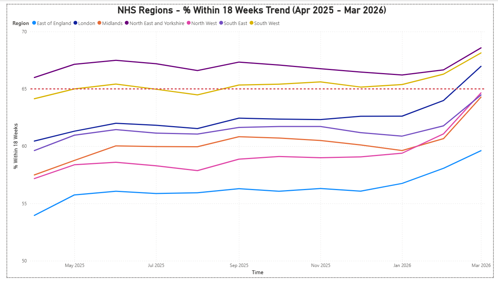

# NHS-RTT

**NHS RTT Waiting Times from April 2025 to March 2026.**

**Overview**

An analysis of NHS Referral to Treatment (RTT) waiting-time data, exploring trends in waiting lists and the distribution of patients waiting for treatment. Using Python and Power IB, this project examines changes in NHS waiting times across Integrated Care Boards (ICBs) and regions, answering the ultimate question: since Labour came into government in 2024, has the government made progress towards its promise to reducing NHS waiting times?

**Methodology**

Data was sourced from [NHS England](https://www.england.nhs.uk/statistics/statistical-work-areas/rtt-waiting-times/rtt-data-2025-26/) using the monthly incomplete commissioner datasets. The data was cleaned and analysed in Python to examine trends in total waiting-list size and the distribution of patients across different waiting-time bands, covering the period from April 2025 to March 2026. 

This report investigates the question: are NHS waiting lists coming down under the Labour government? If not, the analysis further examines whether geographical or regional factors may help explain these trends. Waiting times were compared across Integrated Care Boards (ICBs) and NHS regions to identify differences in performance and patterns across England. 

Visualisations were created using Python and Power BI - an interactive Power BI dashboard and key visualisations are attached to this report.

Code can be found [here](code/nhs_rtt_analysis.py).

**Key Findings**

**National Performance**

In March 2026, the national average of patients seen within 18 weeks was 65.4% — barely meeting the government's interim target of 65%, and far below the constitutional standard of 92%. 

National performance was largely flat between April 2025 and January 2026, hovering around 61-62%, before a sharp improvement in February and March 2026.

.png)

.png)

**ICB Performance**

Only 21 of 42 ICBs (50%) met the government's 65% interim target by March 2026.

In March 2026, a 21 percentage point gap exists between the best and worst performing ICBs, with NHS Mid and South Essex being the worst and NHS Gloucestershire being the best:

The worst: NHS Mid and South Essex was the worst performing ICB in England at 53.1% within 18 weeks.

The Best: NHS Gloucestershire was the best performing ICB at 74.3% within 18 weeks.

.png)

**Most Improved**

Fortunately, every ICB improved over the year, though at vastly different rates.

NHS Shropshire, Telford and Wrekin showed the largest improvement over the year — up 18.3 percentage points from 51.2% to 69.5%.

**Regional Performance**

East of England was the worst performing region throughout the entire year, consistently below all other regions.

North East and Yorkshire were the best performing region, remaining above the 65% interim target for the majority of the year.

Only 3 of 7 NHS regions (North East and Yorkshire, South West and London) met the 65% interim target by March 2026.

.png)

**Conclusion**

While no ICB in England is currently meeting the 92% constitutional standard, every ICB has improved in reducing waiting times under Labour's governance which stands to reason that NHS waiting times are moving in a positive direction and may indicate that the government's efforts to reduce waiting lists are beginning to have an impact. 

However, it should be noted that this report only partially answers the question of whether NHS waiting lists are coming down under Starmer's government, as the analysis covers a one-year period from April 2025 to March 2026 rather than the full period since Labour came into power.

Nevertheless, NHS RTT waiting lists have shown to be improving and this is a promising sign that patients will benefit from government's NHS reforms. Although further analysis over a longer period will be needed to determine whether this represents a sustained improvement.
